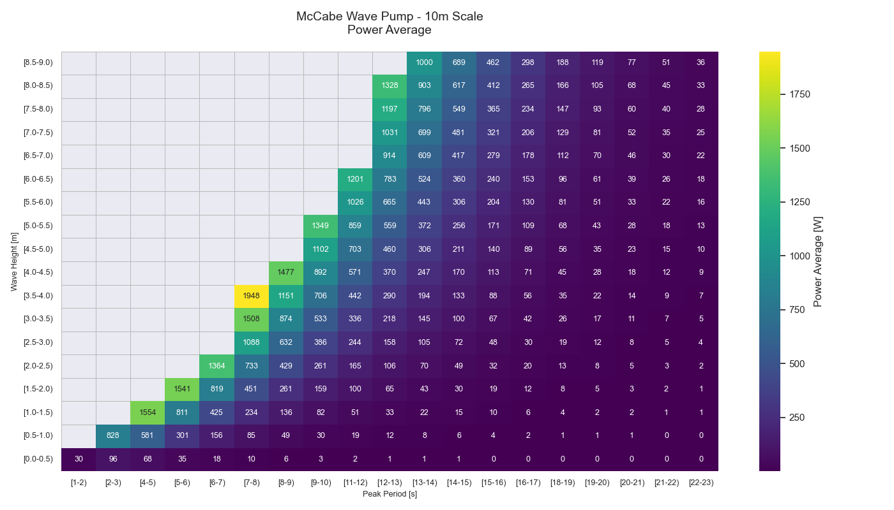

# Small WEC Modeling Data Extractor and Visualizer

This repository contains a Python script designed to extract and visualize data from the [Small WEC
Performance Modeling Tool][small_wec]. The script is intended to be used with the OpenEI Small Scale
Wave Energy Converter (WEC) specifically reading json data from [Small Scale WEC Performance Modeling Data][small_wec_data].

## Numerical Data

- Numerical Data is stored as csv files in the `./data/b1_vap/<test_case>/` directory.:

  - By test case performance data as columnar data: `./data/b1_vap/<test_case>/<test_case>_columnar.csv`
  - By test case metadata: `./data/b1_vap/<test_case>/<test_case>_metadata.json`
  - By test case, by variable peak period numerical binned matrices: `./data/b1_vap/<test_case>/matricies/peak_period/<test_case>_<variable>.csv`
  - By test case, by variable energy period numerical binned matrices: `./data/b1_vap/<test_case>/matricies/energy_period/<test_case>_<variable>.csv`

## Visualizations

- Visualizations: `./viz/by_run/<test_case>/`
  - By test case, by variable peak period matrices as heatmap: `./viz/by_run/<test_case>/matricies/peak_period/<test_case>_<variable>.png`
  - By test case, by variable energy period matrices as heatmap: `./viz/by_run/<test_case>/matricies/energy_period/<test_case>_<variable>.png`
  - By variable, by test case peak period matrices as heatmap: `./viz/by_col/<test_case>/matricies/peak_period/<test_case>_<variable>.png`
  - By variable, by test case energy period matrices as heatmap: `./viz/by_col/<test_case>/matricies/energy_period/<test_case>_<variable>.png`

For data details please refer to the [Small Scale WEC Performance Modeling Data][small_wec_data]
page.

[small_wec]: https://apps.openei.org/swec/devices
[small_wec_data]: https://mhkdr.openei.org/submissions/380
